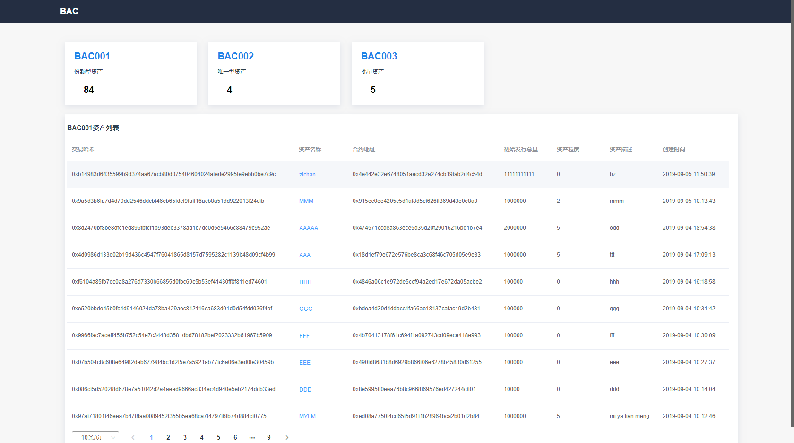

# bac数据导出服务

## 简介

bac-data可以导出区块链上的基础数据，如当前块高、交易总量等。如果正确配置了FISCO-BCOS上运行的所有合约，bac-data可以导出区块链上这些合约的业务数据，包括event、构造函数、合约地址、执行函数的信息等。

bac-data提供了基于Restful的API，支持通过http的方式调用这些接口。

bac-data还集成了Swagger组件，提供了可视化的文档和测试控制台。

bac-data自带的web页面可以查看当前资产概况及资产列表信息，也可以查看各资产的详细信息



## 安装说明

## 1. 拉取代码
执行命令：
```
git clone git@git.weoa.com:ttip/bac-data.git
```

注：本文以`bac-data`代指服务根目录，运维时请按实际更改，如：`/data/bac-data`

## 2. 代码构建
进入主工程目录：

```
cd bac-data/WeBASE-Collect-Bee-core
```
构建：
```
../gradlew build -x test
```

## 3. 修改配置
文件一：
`vi bac-data/WeBASE-Collect-Bee-core/dist/config/application.properties`

```
# 节点ip和channelport
system.nodeStr=node1@127.0.0.1:20800
```

文件二：
`vi bac-data/WeBASE-Collect-Bee-core/dist/config/application-sharding-tables.properties`
```
# 数据库连接信息
sharding.jdbc.datasource.ds.jdbc-url=jdbc:mysql://127.0.0.1:3306/bac_bee1?autoReconnect=true&useSSL=false&serverTimezone=GMT%2b8&useUnicode=true&characterEncoding=UTF-8
sharding.jdbc.datasource.ds.username=root
sharding.jdbc.datasource.ds.password=123456
```

## 4. 证书拷贝
拷贝节点的证书到`bac-data/WeBASE-Collect-Bee-core/dist/config/`
证书包含：node.crt、node.key、ca.crt

## 5. 服务启停
```
进入目录：cd bac-data/WeBASE-Collect-Bee-core/dist
启动：sh start.sh
停止：sh stp.sh
```

## 6. 日志查看
```
进入目录：cd bac-data/WeBASE-Collect-Bee-core/dist/logs
查看sdk日志：tail -f WeBASE-Collect-Bee-web3j.log
查看服务日志：tail -f WeBASE-Collect-Bee.log
```

## 7. 请求地址

 服务界面: `http://{ip}:8899`
 swagger界面：`http://{ip}:8899/swagger-ui.html`